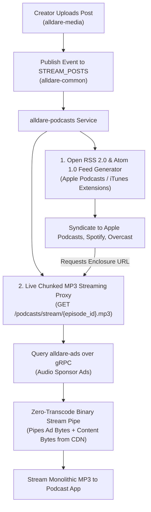

# `alldare-podcasts` — Open RSS/Atom Podcast & Vodcast Syndication Service

> **Port:** `8089` (HTTP API) | `9089` (gRPC Server)  
> **Framework:** Spring Boot 4.x / Java 25  
> **Database:** PostgreSQL 16 + Flyway  
> **Messaging & Cache:** DragonflyDB / Redis Streams  

`alldare-podcasts` is a high-performance Spring Boot microservice responsible for automated RSS 2.0 and Atom 1.0 podcast/vodcast syndication and high-speed live chunked MP3 stream proxying (**Strategy B**) with Dynamic Audio Insertion (DAI).

---

## 1. Architectural Overview

The service transforms Alldare into a zero-friction distribution hub. Creators upload audio or 4K video posts once, and `alldare-podcasts` automatically syndicates their show to global podcast directories (**Apple Podcasts, Spotify, Pocket Casts, Overcast, YouTube Music**). Each podcast show is uniquely identified by a URL-safe **`slug`** (e.g. `building-alldare`), enabling creators to host multiple podcast shows under a single account (`creator_id`).



---

## 2. Key Features

- **Multi-Podcast Per Creator Support:** Uses unique, URL-friendly show `slug` identifier strings, permitting a single creator account to publish multiple podcast shows.
- **Universal Podcast App Compatibility:** Generates open RSS 2.0 XML feeds with full Apple Podcasts / iTunes XML extensions (`<itunes:author>`, `<itunes:duration>`, `<itunes:image>`, `<itunes:category>`, `<itunes:explicit>`).
- **Strategy B Binary Stream Pipe:** Delivers seamless monolithic `.mp3` enclosure streams (`GET /podcasts/stream/{episode_id}.mp3`) by piping sponsor ad bytes from CDN followed immediately by episode content bytes from S3 CDN.
- **Zero Transcode Overhead:** Pours raw binary MP3 frames directly into HTTP chunked response streams without invoking CPU-intensive ffmpeg re-encoders on the fly.
- **Dynamic Audio Insertion (DAI):** Injects 5-to-15 second audio sponsor spots (pre-roll/post-roll) for free-tier listeners ($15.00–$50.00+ Audio CPMs, 55% creator share / 45% platform cut) while bypassing ads for `Alldare+` subscribers.
- **Container Isolation:** Protects core APIs from memory or streaming socket pressure under heavy external podcast downloads.

---

## 3. API Endpoints

### Public Syndication Endpoints
| HTTP Method | Route | Description |
| :--- | :--- | :--- |
| `GET` | `/podcasts/shows/{slug}/rss.xml` | Open RSS 2.0 Podcast XML Feed with iTunes extensions |
| `GET` | `/podcasts/shows/{slug}/atom.xml` | Atom 1.0 Syndication XML Feed |
| `GET` | `/podcasts/stream/{episodeId}.mp3` | High-Speed Live Chunked MP3 Stream Proxy (Strategy B) |

### Internal gRPC Service (`port 9089`)
- `online.alldare.common.grpc.PodcastService/GetPodcastFeed`: Returns compiled XML feed payload for internal caching and gateway verification.

---

## 4. Configuration & Environment Variables

| Variable | Default Value | Description |
| :--- | :--- | :--- |
| `PORT` | `8089` | HTTP Web Application Port |
| `GRPC_SERVER_PORT` | `9089` | gRPC Server Port |
| `SPRING_DATASOURCE_URL` | `jdbc:postgresql://localhost:5432/alldare_podcasts` | PostgreSQL Connection URL |
| `SPRING_DATASOURCE_USERNAME` | `alldare_admin` | Database Username |
| `SPRING_DATASOURCE_PASSWORD` | `password` | Database Password |
| `SPRING_DATA_REDIS_HOST` | `localhost` | Redis / DragonflyDB Host |
| `SPRING_DATA_REDIS_PORT` | `6379` | Redis / DragonflyDB Port |
| `AUTH_ISSUER_URI` | `http://localhost:9000` | OAuth2 Resource Server Issuer URI |
| `CDN_BASE_URL` | `https://cdn.alldare.online` | S3 Media CDN Base URL |
| `FEED_BASE_URL` | `https://podcasts.alldare.online` | Public Podcast Feed Enclosure Base URL |
| `POSTS_GRPC_ADDRESS` | `static://posts:9080` | `alldare-posts` gRPC Server Address |
| `ADS_GRPC_ADDRESS` | `static://ads:9088` | `alldare-ads` gRPC Server Address |

---

## 5. Build, Test & Execution

### Local Build & Test Execution
```bash
# Compile and package microservice
mvn clean package

# Run unit and integration test suite
mvn test
```

### Docker Container Build
```bash
# Build Docker image
docker build -t online.alldare/alldare-podcasts:latest .

# Run container locally
docker run -d -p 8089:8089 -p 9089:9089 --name alldare-podcasts online.alldare/alldare-podcasts:latest
```
