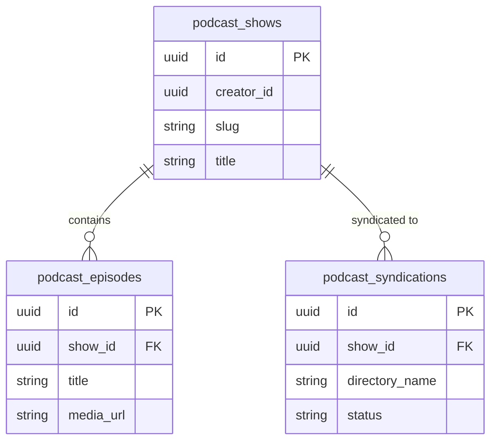

# Architecture Specification: `alldare-podcasts`

This document defines the high-level architecture, Open RSS 2.0 / Atom 1.0 syndication engine, Strategy B live MP3 stream proxying, and directory submission workflow for the **`alldare-podcasts`** microservice.

---

## 1. Domain & Responsibilities

`alldare-podcasts` manages open RSS 2.0 podcast feeds, iTunes XML extensions, Strategy B live MP3 streaming, and automated syndication submissions.

* **Open Syndication Engine**: Generates valid RSS 2.0 XML (`/podcast/{slug}/rss.xml`) and Atom 1.0 feeds (`/podcast/{slug}/atom.xml`) containing `<itunes:author>`, `<itunes:duration>`, and `<itunes:explicit>` extensions.
* **Strategy B High-Speed Live Stream Proxy (`GET /podcasts/stream/{episodeId}.mp3`)**: Pours raw binary MP3 frames directly into HTTP chunked response streams from DigitalOcean Spaces S3 CDN without CPU re-encoding.
* **Dynamic Audio Insertion (DAI)**: Queries `alldare-ads` over gRPC to inject pre-roll audio sponsor ads for free-tier listeners while skipping ads for `Alldare+` subscribers.
* **Port Mapping**: HTTP REST Port: `8089` | gRPC Server Port: `9089`.

---

## 2. Component Topology

