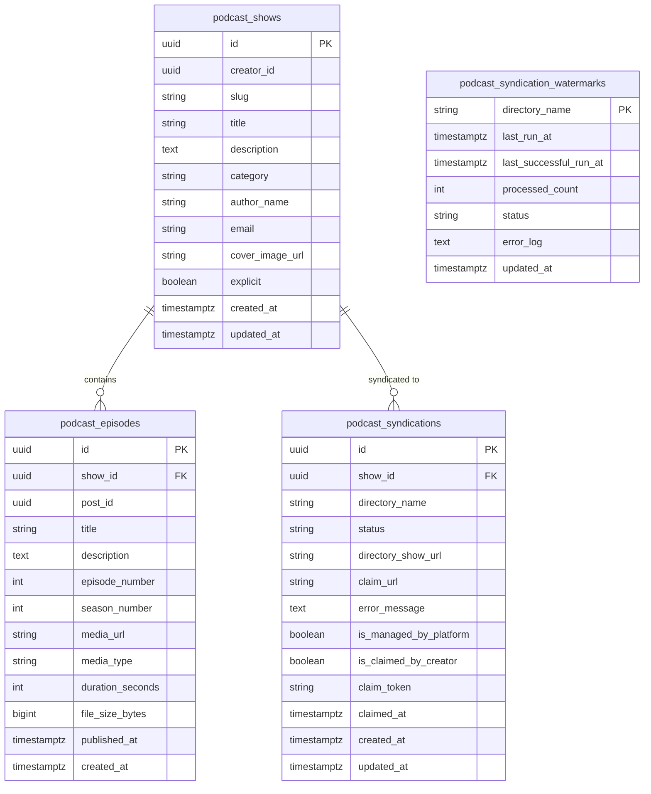

# Database Schema Specification: `alldare-podcasts`

This document defines the relational database schema, Flyway migration history, and indexing strategy for the **`alldare-podcasts`** microservice.

---

## 1. Overview & Database Architecture

* **Database Engine**: PostgreSQL 16
* **Database Name**: `alldare_podcasts`
* **Primary Key Strategy**: `java.util.UUID` (`gen_random_uuid()`)
* **Timestamp Strategy**: `java.time.Instant` (`TIMESTAMP WITH TIME ZONE`)
* **Syndication Architecture**: Open RSS 2.0 / Atom 1.0 feed generation and global podcast directory submission tracking (Apple Podcasts, Spotify, Podcast Index, Listen Notes, Amazon Music).

---

## 2. Entity-Relationship (ER) Diagram

---

## 3. Flyway Migration Ledger

| Version | Migration Script | Description |
| :--- | :--- | :--- |
| `V1` | [`V1__init_podcasts_schema.sql`](file:///home/ben/Projects/alldare/alldare-podcasts/src/main/resources/db/migration/V1__init_podcasts_schema.sql) | Creates core `podcast_shows` and `podcast_episodes` tables with cascade relations. |
| `V2` | [`V2__Create_podcast_syndication_tables.sql`](file:///home/ben/Projects/alldare/alldare-podcasts/src/main/resources/db/migration/V2__Create_podcast_syndication_tables.sql) | Creates `podcast_syndications` and `podcast_syndication_watermarks` tables. |
| `V3` | [`V3__Add_claiming_fields_to_syndications.sql`](file:///home/ben/Projects/alldare/alldare-podcasts/src/main/resources/db/migration/V3__Add_claiming_fields_to_syndications.sql) | Adds creator ownership claiming fields (`is_claimed_by_creator`, `claim_token`, `claimed_at`). |

---

## 4. Complete Table Schema Reference

### 4.1. `podcast_shows` Table
Stores podcast show channels, iTunes XML metadata, and URL-safe slugs.

| Column | Type | Constraints | Description |
| :--- | :--- | :--- | :--- |
| `id` | `UUID` | `PRIMARY KEY` | Unique show identifier. |
| `creator_id` | `UUID` | `NOT NULL` | Creator User UUID (`alldare-profiles`). |
| `slug` | `VARCHAR(255)` | `NOT NULL`, `UNIQUE` | URL-safe show slug (e.g. `building-alldare`). |
| `title` | `VARCHAR(255)` | `NOT NULL` | Show title. |
| `description` | `TEXT` | `NOT NULL` | Full RSS channel description. |
| `category` | `VARCHAR(100)` | `NOT NULL`, Default `'Technology'` | Primary iTunes category. |
| `author_name` | `VARCHAR(255)` | `NOT NULL` | Author / Host name. |
| `email` | `VARCHAR(255)` | `NOT NULL` | Owner email for directory verification. |
| `cover_image_url`| `VARCHAR(1024)`| Nullable | Square 3000x3000px cover artwork URL. |
| `explicit` | `BOOLEAN` | `NOT NULL`, Default `FALSE` | Explicit content indicator (`<itunes:explicit>`). |
| `created_at` | `TIMESTAMPTZ` | `NOT NULL`, Default `CURRENT_TIMESTAMP` | Channel creation timestamp. |
| `updated_at` | `TIMESTAMPTZ` | `NOT NULL`, Default `CURRENT_TIMESTAMP` | Channel update timestamp. |

### 4.2. `podcast_episodes` Table
Stores audio/video podcast episodes and enclosure metadata.

| Column | Type | Constraints | Description |
| :--- | :--- | :--- | :--- |
| `id` | `UUID` | `PRIMARY KEY` | Unique episode ID. |
| `show_id` | `UUID` | `NOT NULL`, `REFERENCES podcast_shows(id) ON DELETE CASCADE` | Parent show channel UUID. |
| `post_id` | `UUID` | `UNIQUE` | Optional linked Post UUID (`alldare-posts`). |
| `title` | `VARCHAR(255)` | `NOT NULL` | Episode title. |
| `description` | `TEXT` | `NOT NULL` | Episode show notes description. |
| `episode_number` | `INT` | Nullable | Episode sequence number (`<itunes:episode>`). |
| `season_number` | `INT` | Nullable | Season sequence number (`<itunes:season>`). |
| `media_url` | `VARCHAR(1024)`| `NOT NULL` | Direct S3 / CDN media enclosure URL. |
| `media_type` | `VARCHAR(100)` | `NOT NULL`, Default `'audio/mpeg'` | MIME enclosure type (`audio/mpeg`, `video/mp4`). |
| `duration_seconds`| `INT` | `NOT NULL`, Default `0` | Audio/video duration in seconds (`<itunes:duration>`). |
| `file_size_bytes` | `BIGINT` | `NOT NULL`, Default `0` | Media file size in bytes for RSS enclosure header. |
| `published_at` | `TIMESTAMPTZ` | `NOT NULL`, Default `CURRENT_TIMESTAMP` | RSS publication timestamp (`<pubDate>`). |
| `created_at` | `TIMESTAMPTZ` | `NOT NULL`, Default `CURRENT_TIMESTAMP` | Record creation timestamp. |

### 4.3. `podcast_syndications` Table
Tracks global podcast directory submission status and creator ownership transfers.

| Column | Type | Constraints | Description |
| :--- | :--- | :--- | :--- |
| `id` | `UUID` | `PRIMARY KEY` | Unique syndication tracking ID. |
| `show_id` | `UUID` | `NOT NULL`, `REFERENCES podcast_shows(id) ON DELETE CASCADE` | Target show UUID. |
| `directory_name` | `VARCHAR(50)` | `NOT NULL` | Directory name (`SPOTIFY`, `APPLE`, `PODCAST_INDEX`, `LISTEN_NOTES`, `AMAZON`). |
| `status` | `VARCHAR(30)` | `NOT NULL`, Default `'PENDING'` | Submission state (`PENDING`, `SUBMITTED`, `INDEXED`, `FAILED`). |
| `directory_show_url`| `VARCHAR(500)`| Nullable | Directory public show listing URL. |
| `claim_url` | `VARCHAR(500)`| Nullable | Directory claim portal URL for creator ownership transfer. |
| `error_message` | `TEXT` | Nullable | Submission error log excerpt. |
| `is_managed_by_platform`| `BOOLEAN`| `NOT NULL`, Default `TRUE` | True if platform manages RSS submission. |
| `is_claimed_by_creator` | `BOOLEAN`| `NOT NULL`, Default `FALSE` | True if creator transferred directory ownership. |
| `claim_token` | `VARCHAR(100)`| Nullable | Cryptographic verification claim token. |
| `claimed_at` | `TIMESTAMPTZ` | Nullable | Timestamp of creator ownership claim. |

### 4.4. `podcast_syndication_watermarks` Table
Maintains cron job execution watermarks for directory syndication background workers.

| Column | Type | Constraints | Description |
| :--- | :--- | :--- | :--- |
| `directory_name` | `VARCHAR(50)` | `PRIMARY KEY` | Directory identifier string. |
| `last_run_at` | `TIMESTAMPTZ` | Nullable | Timestamp of last worker run start. |
| `last_successful_run_at`| `TIMESTAMPTZ`| Nullable | Timestamp of last error-free execution. |
| `processed_count` | `INT` | `NOT NULL`, Default `0` | Total shows processed during last run. |
| `status` | `VARCHAR(30)` | `NOT NULL`, Default `'IDLE'` | Worker status (`IDLE`, `RUNNING`, `FAILED`). |
| `error_log` | `TEXT` | Nullable | Error log excerpt from last run. |
| `updated_at` | `TIMESTAMPTZ` | `NOT NULL`, Default `CURRENT_TIMESTAMP` | Watermark update timestamp. |

---

## 5. Indexing & Optimization Strategy

1. **Show Slug Lookup Index**:
   `CREATE INDEX idx_podcast_shows_slug ON podcast_shows(slug);`
   Provides instantaneous O(1) lookup for public RSS 2.0 feed requests (`GET /podcasts/shows/{slug}/rss.xml`).

2. **Episodes Show FK Index**:
   `CREATE INDEX idx_podcast_episodes_show_id ON podcast_episodes(show_id);`
   Optimizes retrieval of all episodes belonging to a specific podcast show.

3. **Syndication Status Index**:
   `CREATE INDEX idx_podcast_syndications_dir_status ON podcast_syndications(directory_name, status);`
   Accelerates scheduled directory batch syndication jobs.
